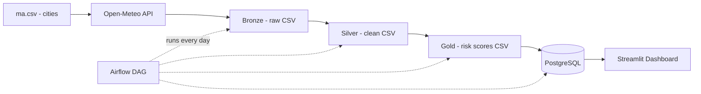
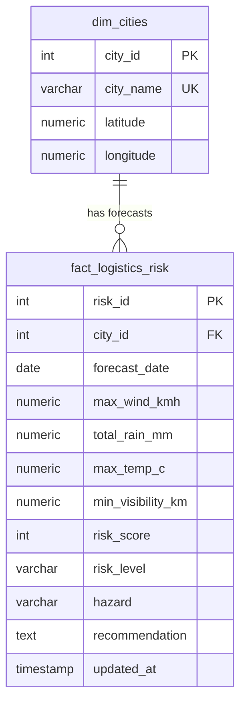
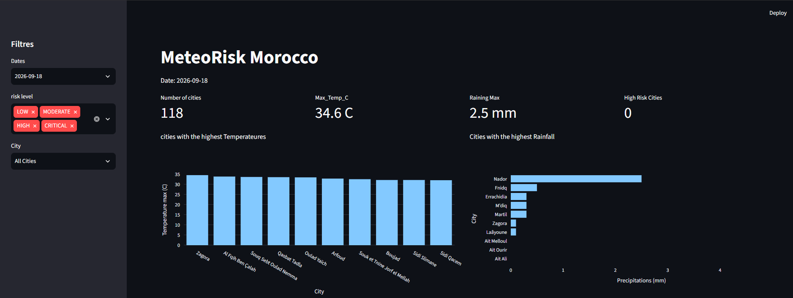
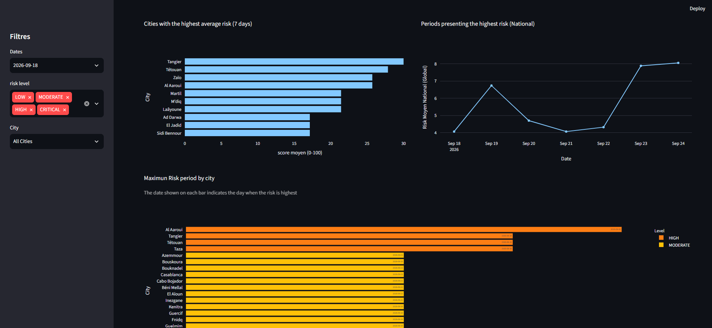
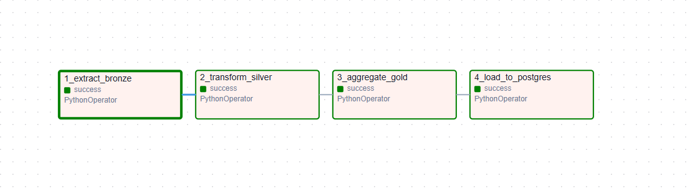

# MeteoRisk | Weather Risk for Deliveries in Morocco

MeteoRisk is a data pipeline that helps a delivery company in Morocco plan its trips.
It collects the weather forecast for Moroccan cities, cleans the data, calculates a
**risk score from 0 to 100**, saves the result in **PostgreSQL**, and shows everything
on a **Streamlit** dashboard. The full pipeline runs every day with **Apache Airflow**.
Everything runs inside **Docker**.

---

## 1. Project Goal

Bad weather (strong wind, heavy rain, fog, extreme heat) causes delays and accidents
for trucks. The company wants to know:

**Which cities and which days will have the highest weather risk in the next 7 days?**

With this answer, a manager can:
- compare cities,
- see the dangerous days,
- change the delivery plan before problems happen.

---

## 2. Data Sources

| Source | What it gives | Where it is used |
|---|---|---|
| **SimpleMaps** (`data/ma.csv`) | 120 Moroccan cities with latitude and longitude | To know where to ask the weather |
| **Open-Meteo API** | 7-day weather forecast (temperature, rain, wind gusts, visibility) | Main weather data |

Open-Meteo is free and does not need an API key.

Example of the call made for each city:

```text
https://api.open-meteo.com/v1/forecast?latitude=33.59&longitude=-7.62&hourly=temperature_2m,precipitation,wind_gusts_10m,visibility&timezone=Africa/Casablanca&forecast_days=7
```

Error handling in the extraction step:
- timeout of 10 seconds per call,
- HTTP errors are caught and printed, the pipeline continues with the next city,
- a small pause (`time.sleep(0.2)`) between calls to respect the API limit.

---

## 3. How the Pipeline Works



### Bronze (`data/bronze/weather_raw.csv`)
Raw data exactly as it comes from the API. Nothing is changed. One row per city and per hour.

### Silver (`data/silver/weather_clean.csv`)
Clean data:
- dates converted to real date types,
- visibility converted from meters to kilometers,
- numbers rounded to 1 decimal,
- duplicate rows removed (same city + same hour),
- city coordinates joined with the weather.

### Gold (`data/gold/daily_risk.csv`)
Data grouped by city and by day:
- max wind, total rain, max temperature, min visibility,
- risk score, risk level, hazard, recommendation.

### PostgreSQL
The Gold data is loaded into two tables (see section 4).
If the pipeline runs again, old rows are **updated, not duplicated**.

---

## 4. Database Model (ERD)



- `dim_cities`: one row per city.
- `fact_logistics_risk`: one row per city per day.
- The rule `UNIQUE (city_id, forecast_date)` stops duplicates.
  The loader uses `ON CONFLICT ... DO UPDATE` so new forecasts replace old ones.

The full SQL is in `sql/schema.sql`.

---

## 5. How the Risk Score Works (0 to 100)

We add points for each dangerous condition. The total is limited to 100.

| Weather | Condition | Points | Why it matters for trucks |
|---|---|---|---|
| Wind gusts | 50 km/h or more | +30 | Trucks become unstable |
| Wind gusts | 70 km/h or more | +45 | High risk of trucks turning over |
| Rain (per day) | 10 mm or more | +10 | Slippery roads |
| Rain (per day) | 20 mm or more | +35 | Risk of floods, roads cut |
| Visibility | 1.5 km or less | +30 | Fog or sand, drivers cannot see |
| Temperature | 42 °C or more | +20 | Tires and refrigerated trucks fail |

**Risk score = wind points + rain points + visibility points + heat points (maximum 100)**

| Score | Level | Recommendation |
|---|---|---|
| 0 - 19 | LOW | All routes clear |
| 20 - 39 | MODERATE | Drivers should be careful |
| 40 - 69 | HIGH | Expect delays, check that cargo is secured |
| 70 - 100 | CRITICAL | Stop or reroute heavy trucks |

The code is in the function `compute_risk()` in `src/load/load_data.py`.

---

## 6. Project Structure

```text
MeteoRisk/
├── dags/
│   └── meteorisk_dag.py            # Airflow DAG (4 tasks, runs daily)
├── data/
│   ├── ma.csv                      # Cities from SimpleMaps
│   ├── bronze/weather_raw.csv      # Raw data
│   ├── silver/weather_clean.csv    # Clean data
│   └── gold/daily_risk.csv         # Daily risk scores
├── docs/
│   └── screenshots/                # Dashboard and Airflow screenshots
├── requirements/
│   ├── airflow.txt                 # Python packages for Airflow
│   └── streamlit.txt               # Python packages for Streamlit
├── sql/
│   ├── schema.sql                  # Create the tables
│   └── queries.sql                 # 5 business queries
├── src/
│   ├── extract/extract_data.py     # API -> Bronze
│   ├── transform/transform_data.py # Bronze -> Silver
│   ├── load/load_data.py           # Silver -> Gold -> PostgreSQL
│   └── main.py                     # Runs all steps by hand
├── streamlit/
│   └── app.py                      # Dashboard
├── Dockerfile.airflow
├── Dockerfile.streamlit
├── docker-compose.yaml
└── README.md
```

---

## 7. SQL Business Queries

The file `sql/queries.sql` answers these questions:

1. Which cities will have the highest temperatures?
2. Which cities will have the most rain?
3. Which cities have the highest average risk over 7 days?
4. Which dates have the highest risk for the whole country?
5. For each city, which day is the most dangerous?

Plus a small query for global numbers: number of cities, max temperature, max rain.

Run them:

```bash
docker exec -i meteorisk_db psql -U airflow -d meteorisk < sql/queries.sql
```

---

## 8. Streamlit Dashboard

The dashboard reads directly from PostgreSQL.

**Filters (left side):**
- Date
- Risk level (LOW, MODERATE, HIGH, CRITICAL)
- City

**Top numbers:**
- Number of cities
- Max temperature
- Max rain
- Number of high-risk cities

**Charts:**
- **Q1:** cities with the highest temperature
- **Q2:** cities with the most rain
- **Q3:** cities with the highest average risk
- **Q4:** risk by date for the whole country
- **Q5:** worst day for each city (the date is written on each bar)

### Screenshots







---

## 9. Airflow DAG

- **File:** `dags/meteorisk_dag.py`
- **DAG name:** `meteorisk_etl_pipeline`

```text
1_extract_bronze  ->  2_transform_silver  ->  3_aggregate_gold  ->  4_load_to_postgres
```

- **Schedule:** every day (`@daily`)
- **Retries:** 2 times, 2 minutes between retries
- **Catchup:** `catchup=False`, it does not try to run the missed days from the past

---

## 10. How to Install and Run

### You need
- Docker Desktop installed and running
- Free ports: `5433` (PostgreSQL), `8080` (Airflow), `8501` (Streamlit)

### Step 1 | Get the code

```bash
git clone https://github.com/hamzalafsioui/meteoRisk.git
cd meteoRisk
```

### Step 2 | Start everything

```bash
docker compose up --build -d
```

Wait about 30 seconds. Then check:

```bash
docker compose ps
```

You should see 4 containers running:
`meteorisk_db`, `meteorisk_airflow_web`, `meteorisk_airflow_scheduler`, `meteorisk_streamlit`.

### Step 3 | Run the pipeline

**Option A: with Airflow (recommended)**

1. Open [http://localhost:8080](http://localhost:8080) (user: `admin`, password: `admin`)
2. Turn on the DAG `meteorisk_etl_pipeline`
3. Click the play button to run it
4. Wait about 2 minutes, all 4 tasks become green

Or from the terminal:

```bash
docker exec -it meteorisk_airflow_web airflow dags trigger meteorisk_etl_pipeline
```

**Option B: by hand, without Airflow**

```bash
docker exec -it meteorisk_airflow_web python -m src.main
```

### Step 4 | Check the database

```bash
docker exec -it meteorisk_db psql -U airflow -d meteorisk -c "SELECT COUNT(*) FROM fact_logistics_risk;"
```

You should see about 840 rows (120 cities × 7 days).

### Step 5 | Open the dashboard

[http://localhost:8501](http://localhost:8501)

### Stop everything

```bash
docker compose down        # stop containers, keep data
docker compose down -v     # stop containers and delete database data
```

---

## 11. Useful Connection Info

| Service | Address | Login |
|---|---|---|
| **Airflow** | [http://localhost:8080](http://localhost:8080) | `admin` / `airflow` → `admin` / `admin` |
| **Streamlit** | [http://localhost:8501](http://localhost:8501) | none |
| **PostgreSQL (from your PC)** | `localhost:5433`, database `meteorisk` | `airflow` / `airflow` |
| **PostgreSQL (inside Docker)** | `postgres:5432`, database `meteorisk` | `airflow` / `airflow` |

---

## 12. Tools Used

- **Python 3.11:** pandas, requests, SQLAlchemy, psycopg2
- **Database:** PostgreSQL 16
- **Orchestration:** Apache Airflow 2.9.3
- **Dashboard:** Streamlit + Plotly
- **Infrastructure:** Docker Compose
